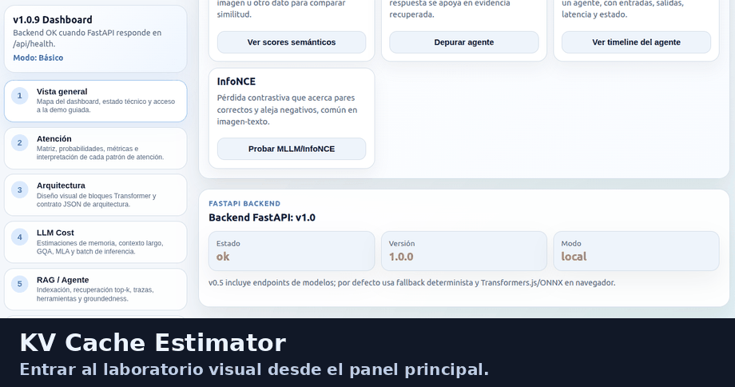
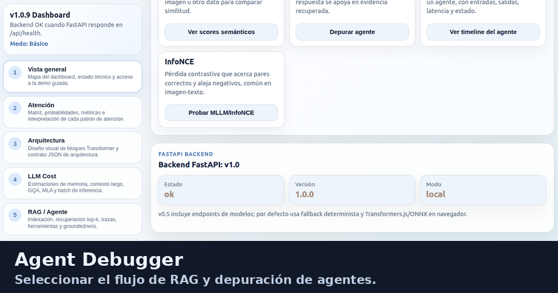
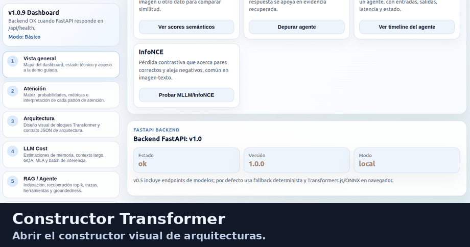
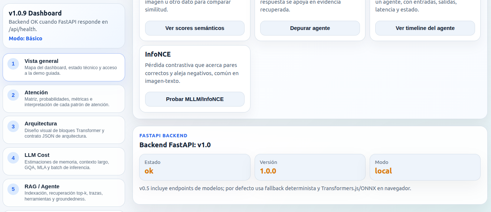
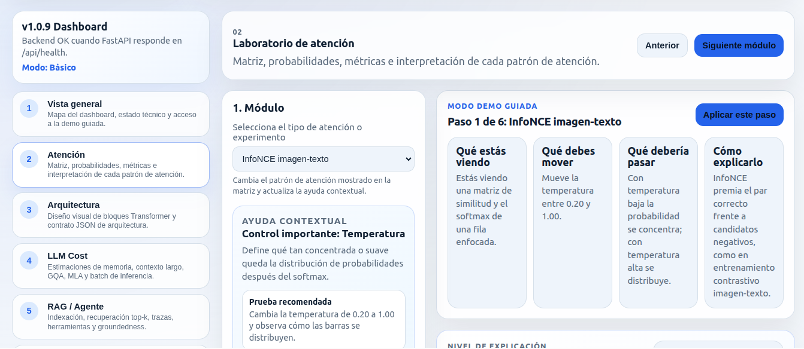
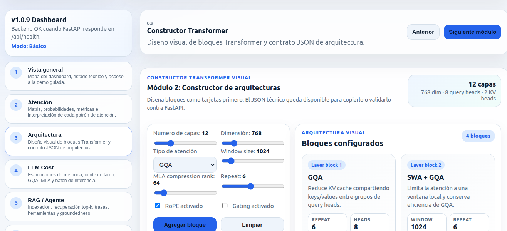
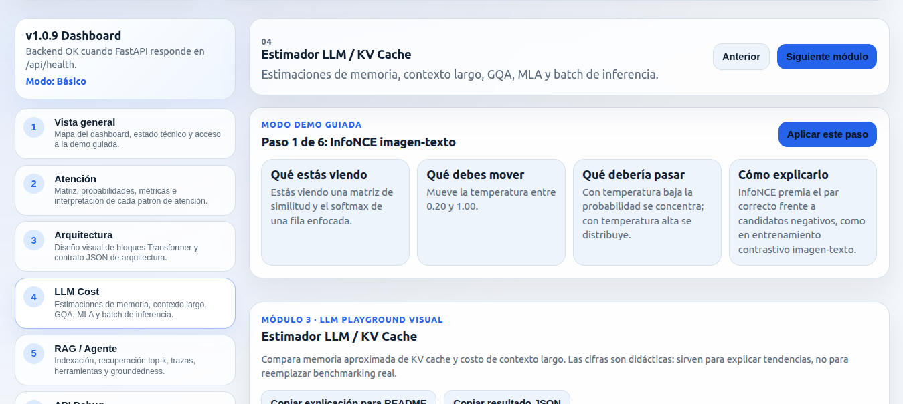
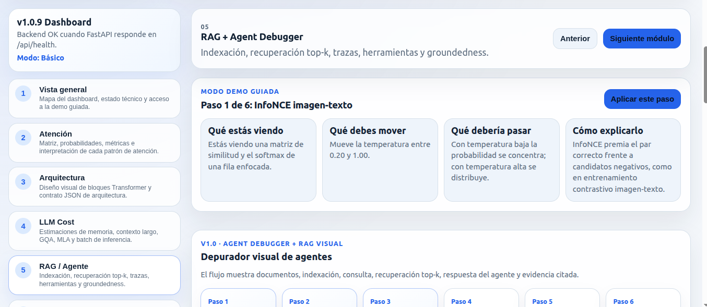
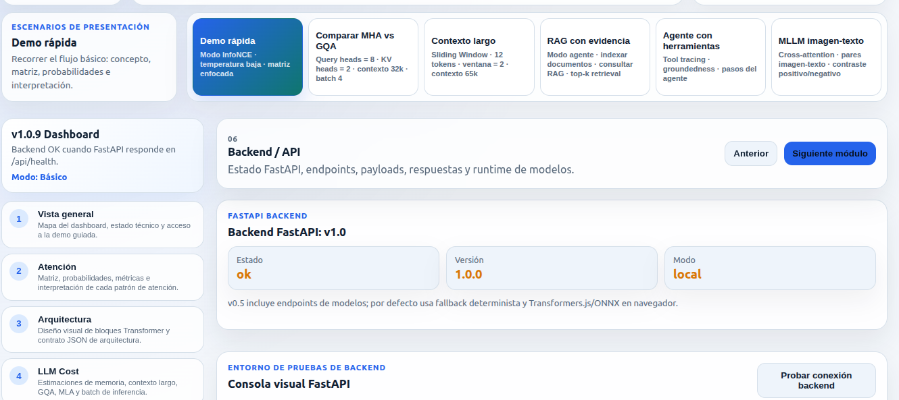
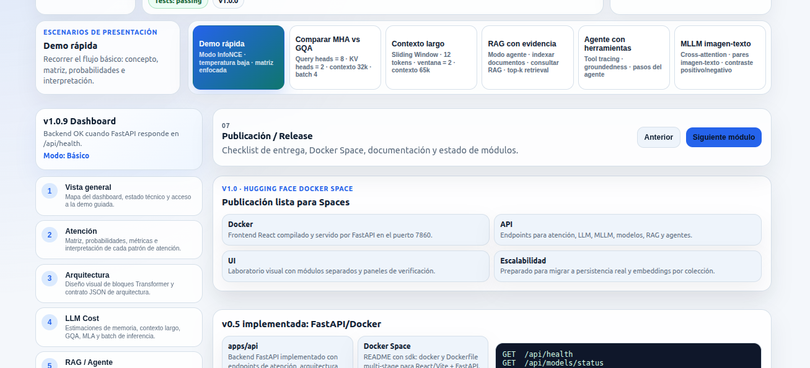

[](https://kapumota-attentio-ai-lab.hf.space)


### Attentio AI Lab

### Demo en vivo

#### Vista rápida

Los siguientes GIFs muestran los flujos principales sin instalar nada.








- Hugging Face Space: [Hugging Face Space](https://kapumota-attentio-ai-lab.hf.space)
- Ejecución local rápida:

```bash
docker build -t attentio-ai-lab:v1.1.0-dev .
docker run --rm -p 7860:7860 attentio-ai-lab:v1.1.0-dev
```

Abrir en el navegador:

```text
http://localhost:7860
```

Validar API:

```bash
curl http://localhost:7860/api/health
```


**Attentio AI Lab** implementa un laboratorio interactivo de sistemas de IA generativa con separación clara entre interfaz, contratos de datos y servicios backend. En el frontend, React y TypeScript modelan la experiencia visual: matriz de atención interactiva con encabezados de fila/columna, inspector de celdas, modos Básico/Técnico/Experto, demostración guiada, presets de escenarios, constructor visual de bloques Transformer, gráficos de KV cache, timeline de agentes y consola API con copiado de payloads.

En el backend, FastAPI expone endpoints tipados con Pydantic para cómputo didáctico de atención, validación de arquitecturas, estimación de memoria/costo de LLMs, contraste multimodal InfoNCE, RAG en memoria, trazas de agente y experimentos ligeros.

La aplicación funciona por defecto en modo determinístico/fallback, sin requerir GPU ni credenciales de OpenAI. Esto permite ejecución local reproducible, pruebas automatizadas, CI y despliegue como Docker Space. Los modelos reales son opcionales y pueden activarse mediante dependencias adicionales y variables de entorno.

> **Estado:** versión técnica `v1.1.0-dev`, lista para GitHub y Hugging Face Docker Spaces. No es un LLM entrenado desde cero ni un RAG productivo con base vectorial persistente; es una herramienta didáctica y reproducible para explicar conceptos técnicos de IA moderna.


#### Capturas

Las capturas están en la carpeta [`screenshots/`](https://github.com/kapumota/attentio-ai-lab/tree/main/screenshots).

##### 1. Vista general del panel



##### 2. Laboratorio de atención



##### 3. Constructor Transformer



##### 4. Estimador LLM / KV Cache



##### 5. RAG + Agent Debugger



##### 6. Backend / API



##### 7. Publicación / Hugging Face Docker Space



#### Características principales

| Área | Incluye |
|---|---|
| Panel guiado | Navegación por secciones, demo guiada, presets y modos Básico/Técnico/Experto |
| Laboratorio de atención | Matriz interactiva con encabezados, inspector de celda, softmax, temperatura, máscaras causal/local/top-k, GQA e InfoNCE |
| Constructor Transformer | Bloques visuales de capas, SWA/GQA/MLA, RoPE, gating, JSON técnico colapsable y validación backend |
| Estimador LLM | KV cache MHA/GQA/MLA, gráficas, contexto largo, batch size, tokens/s estimados y panel comparativo |
| MLLM playground | Alineación imagen-texto, candidatos editables, ranking InfoNCE e interpretación didáctica |
| RAG + Agent Debugger | Pipeline visual, indexación, recuperación top-k, scores, citas, groundedness, tool tracing y timeline del agente |
| Backend / API | Consola visual con request, response, latencia, interpretación, errores comunes y botones de copia |
| Robustez frontend | ErrorBoundary, accesibilidad, role=status, aria-labels, mensajes de error guiados y copiado para README |
| Deploy | Dockerfile multi-stage, puerto `7860`, compatible con Hugging Face Docker Spaces |

#### No requiere OpenAI API

El proyecto funciona por defecto sin credenciales externas:

```text
OpenAI API: no requerida
Modo backend: determinístico / fallback ligero
GPU: no requerida
```

Los modelos reales son opcionales y se activan solo si instalas dependencias adicionales y defines variables de entorno.

#### Arquitectura de alto nivel

```text
Navegador
  │
  ▼
React + TypeScript + Vite
  ├─ Panel educativo
  ├─ Matriz de atención interactiva
  ├─ Constructor Transformer
  ├─ LLM / KV Cache playground
  ├─ MLLM / InfoNCE playground
  ├─ RAG + Agent Debugger
  └─ Consola API del backend
  │
  ▼
FastAPI + Pydantic
  ├─ /api/attention/compute
  ├─ /api/architecture/validate
  ├─ /api/llm/estimate
  ├─ /api/mllm/contrastive-batch
  ├─ /api/rag/*
  ├─ /api/agents/*
  └─ /api/models/*
  │
  ▼
Modo determinístico / modelos opcionales
```
#### Ubicación del frontend

El frontend está en:

```text
apps/web
```

Archivos principales:

```text
apps/web/src/App.tsx                         # Panel principal
apps/web/src/main.tsx                        # Entrada React
apps/web/src/styles.css                      # Estilos globales
apps/web/src/components/                     # Componentes UI
apps/web/src/components/AttentionMatrix.tsx
apps/web/src/components/ControlPanel.tsx
apps/web/src/components/BackendPlayground.tsx
apps/web/src/components/AgentDebuggerPlayground.tsx
apps/web/src/components/ArchitectureBuilder.tsx
apps/web/src/components/LLMPlayground.tsx
apps/web/src/components/MLLMPlayground.tsx
apps/web/src/components/GlossaryPanel.tsx
apps/web/src/components/ErrorBoundary.tsx
apps/web/src/components/CopyButton.tsx
apps/web/src/core/apiClient.ts               # Cliente HTTP del frontend
apps/web/src/config/api.ts                   # Base URL de API
apps/web/vite.config.ts                      # Proxy local /api a FastAPI
```

#### Requisitos

- Node.js `^20.19.0` o `>=22.12.0`. Recomendado: Node 22 LTS.
- Python 3.10 o 3.11. Recomendado local: Python 3.10/3.11 con `pyenv`; Docker usa Python 3.11.
- Docker opcional para validar Hugging Face Docker Spaces.

#### Instalación local recomendada

##### 1. Python con pyenv y entorno `.atencion`

```bash
pyenv local 3.10.x
python --version

python -m venv .atencion
source .atencion/bin/activate

python -m pip install --upgrade pip
pip install -r apps/api/requirements-dev.txt
```

##### 2. Frontend con npm limpio

```bash
nvm use 22
npm config set registry https://registry.npmjs.org/
npm --prefix apps/web ci --no-audit --no-fund
```

`npm ci` se recomienda para una instalación reproducible basada en `package-lock.json`.

#### Ejecutar en desarrollo local

Usa dos terminales.

#### Terminal 1: backend FastAPI

```bash
cd attentio-ai-lab
source .atencion/bin/activate
PYTHONPATH=apps/api uvicorn app.main:app --reload --host 0.0.0.0 --port 8000
```

Backend:

```text
http://localhost:8000
http://localhost:8000/api/health
http://localhost:8000/docs
```

#### Terminal 2: frontend Vite

```bash
cd attentio-ai-lab
npm --prefix apps/web run dev
```

Frontend:

```text
http://localhost:5173
```

En desarrollo, Vite usa proxy para enviar `/api/*` hacia `http://localhost:8000`.

#### Ejecutar como aplicación integrada FastAPI

```bash
npm --prefix apps/web run build
export ATTENTIONLAB_STATIC_DIR="$PWD/apps/web/dist"
PYTHONPATH=apps/api uvicorn app.main:app --host 0.0.0.0 --port 7860
```

Abre:

```text
http://localhost:7860
http://localhost:7860/api/health
http://localhost:7860/docs
```

#### Docker

```bash
docker build -t attentio-ai-lab:v1.1.0-dev .
docker run --rm -p 7860:7860 attentio-ai-lab:v1.1.0-dev
```

Con Docker Compose:

```bash
docker compose up --build
```

Luego abre:

```text
http://localhost:7860
```

#### Hugging Face Docker Space

La subida y verificación pública del Space corresponde a la Fase 2. En esta Fase 1 se deja la identidad, la versión y la imagen Docker preparadas para ese despliegue.

Configuración objetivo para el `README.md` del Space:

```yaml
sdk: docker
app_port: 7860
```

Subida manual en la Fase 2:

```bash
git remote add space https://huggingface.co/spaces/HF_USERNAME/attentio-ai-lab
git push --force space main
```

También puedes usar GitHub Actions con `HF_TOKEN`, reemplazando `HF_USERNAME/attentio-ai-lab` por tu repo real.

#### Validación

```bash
npm --prefix apps/web run check
PYTHONPATH=apps/api python -m pytest apps/api/tests -q
bash scripts/validate-local.sh
```

Validación Docker:

```bash
bash scripts/validate-docker.sh
```

#### Endpoints principales

```text
GET  /api/health
GET  /api/models/status
GET  /api/models/runtime
POST /api/models/embed
POST /api/models/generate
POST /api/models/contrastive-texts
POST /api/attention/compute
POST /api/architecture/validate
POST /api/llm/estimate
POST /api/mllm/contrastive-batch
POST /api/agents/trace
POST /api/agents/debug
GET  /api/rag/status
POST /api/rag/ingest
POST /api/rag/query
POST /api/experiments/save
GET  /api/experiments
```

#### Modelos reales opcionales

Por defecto el backend usa fallback determinista. Para activar modelos reales opcionales:

```bash
pip install -r apps/api/requirements-v1.1.optional.txt
export ATTENTIONLAB_ENABLE_REAL_MODELS=true
export ATTENTIONLAB_EMBEDDING_MODEL_ID=sentence-transformers/all-MiniLM-L6-v2
export ATTENTIONLAB_TEXT_MODEL_ID=distilbert-base-uncased
```

### Ejemplos de uso

Puedes ver ejemplos de uso en la carpeta de documentación, en el archivo `EJEMPLOS_USO.md`

## Licencia
MIT. Ver `LICENSE`.
